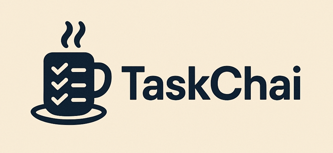

<p align="center"></p>

TaskChai is a lightweight but slightly opinionated framework for defining and running multi-step workflows. It allows you to create specialized tasks and chain them together to accomplish complex objectives.

## Core Concepts

The framework is built around the idea of **Tasks**.

*   **Tasks**: Tasks define a unit of work that can be executed. They can be chained together to create complex workflows. The framework demonstrates how to define a collection of tasks (a "mission") and run it.

    *   Example Task Definition (conceptual):
        ```typescript

        // Example of a simple task with a prompt
        const getGardeningAdvice = T("You are a gardening expert. Suggest a watering schedule for tomatoes in a sunny location.");

        // Example of a task executing a function
        const getWeatherReport = T(() => fetchWeatherForLocation("my_zip_code"));

        // Example of chaining tasks
        const complexGardeningPlan = getWeatherReport
          .then(weatherData => T(`Based on this weather: ${JSON.stringify(weatherData)}, advise on tomato care.`))
          .then(gardeningAdvice => T(`Format this advice for a beginner: ${gardeningAdvice}`));

        // To run a task:
        const result = complexGardeningPlan.run();
        ```

## Advanced Task Configuration

Here are some ways you can configure and use tasks:

*   **Variables**:
    *   Variables can be specified at the task definition level or when a task sequence (mission) is run.
    *   Run-level variables propagate to all tasks within that run. This is useful for providing shared context or data.
    *   A clever use of run variables is to fetch data needed by multiple tasks *before* any task in the sequence begins execution. For example, loading a user profile or fetching global settings.

    ```typescript

    const taskWithVariables = T("Analyze data for {{item}}", { variables: { item: "Product A" } });

    const mission = T("Extract numbers from {{sharedData}}")
                    .then("Extract action items from {{sharedData}}")
                    .then("Summarize findings from {{sharedData}}")
                    .then(email_results);
    
    // Fetching data as a run variable
    const initialData = await someAsyncDataFetch();
    mission.run({ variables: { sharedData: initialData } });
    ```

*   **Task Types**: Tasks can be defined in several ways:
    *   **Strings**: A simple string can define a task, often representing a prompt for an AI model.
        ```typescript
        const simpleTask = T("Summarize the following text:\n{{text}}", { variables: { text: "Long article content here..." } });
        ```
    *   **Functions**: A function can be a task, allowing for custom logic, API calls, or data transformations.
        ```typescript
        const functionalTask = T(async (context) => {
          // context might contain results from previous tasks or run variables
          const apiResult = await fetchExternalData(context.someInput);
          return processData(apiResult);
        });
        ```
    *   **Arrays of other Tasks (Parallel Execution)**: An array of tasks will be scheduled to run in parallel. The results are then combined and passed to the next task in a sequence.
        ```typescript
        const fetchDataTask1 = T(async () => fetchDataType1());
        const fetchDataTask2 = T(async () => fetchDataType2());

        const combinedDataTask = T([fetchDataTask1, fetchDataTask2]);
        ```
    *  **Chaining Tasks**: Tasks can be chained together using `.then()` to create a sequence of operations. Each task can take the output of the previous task as input.
        ```typescript
        const taskChain = T(fetch_user_data)
          .then("Analyze user preferences")
          .then("Generate personalized recommendations")
          .then(send_recommendations_email);
        ```
